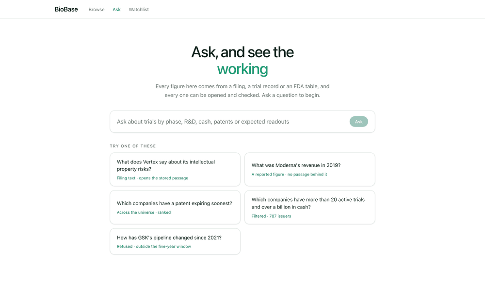
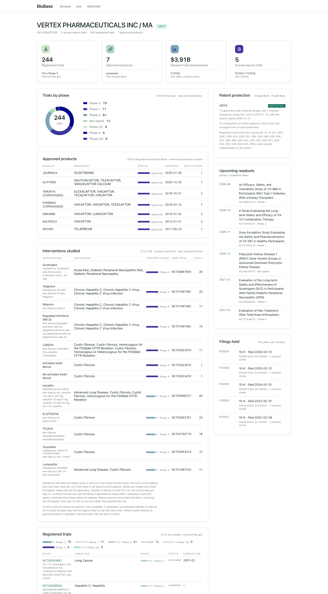
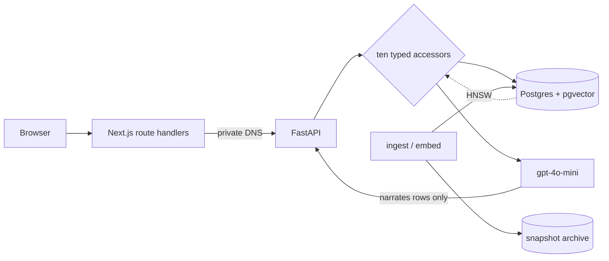

# BioBase

**Grounded question answering over every public biotech company that files with the SEC, where each figure carries the document it came from.**

[Pipeline](PIPELINE.md) · [Evaluation](EVALUATION.md) · [Deployment](DEPLOY.md) · [Roadmap](ROADMAP.md)


787 companies, 30,823 trials they lead and 112,812 more from the wider registry,
3,614 annual reports at five years each, split into 334,624 embedded passages.
It is not an agent: the model chooses among ten typed accessors in a bounded
loop and narrates what they return, and it cannot introduce a figure of its own.
When the data does not support an answer it says so, and the refusal is as
traceable as an answer.

---

## Demo

A question, and what comes back. Every citation resolves to the passage the model
was allowed to read and to the filing it was cut from.

```bash
$ curl -s $SITE/api/ask -H 'content-type: application/json' \
    -d '{"question": "What does Vertex say about its intellectual property risks?"}'
```

```json
{
  "answer": "Vertex discusses several intellectual property risks in its annual
             report:\n\n1. **Compulsory Licensing**: Foreign countries may enforce
             compulsory licensing laws that require patent owners to grant licenses
             to third parties... [1]",
  "tools_used": ["search_filings"],
  "dropped_citations": 0,
  "evidence": [{
    "n": 1,
    "tool": "search_filings",
    "label": "searched annual report text",
    "source": "SEC EDGAR",
    "tickers": ["VRTX"],
    "documents": [{
      "label": "VRTX FY2025 10-K",
      "detail": "risk_factors · filed 2026-02-13",
      "accession": "0000875320-26-000056",
      "chunk_id": 207497,
      "url": "https://www.sec.gov/Archives/edgar/data/875320/000087532026000056/vrtx-20251231.htm"
    }]
  }]
}
```

`chunk_id` is the point. It resolves to the exact stored passage, character for
character, so "this number came from that document" is checkable rather than
asserted. `dropped_citations` counts markers the model wrote against blocks that
were never returned; they are stripped before the answer is shown, because a
number that looks sourced and is not is the failure this project exists to
prevent.



Typed once against the deployed site: a question, the accessor that ran, the
answer with numbered citations, and a citation opened into the passage the model
was allowed to read.

That last step is the product. Opening a chip gives you the document it came
from, the passage inside it, and how much of the section that passage is:


`VRTX · 10-K · FY2025 · filed 2026-02-13 · risk factors · passage 14 of 27`, and
2,991 characters of it, stored verbatim. Below that sits the original document
with its CIK and accession, on a recessed plane behind an outlined control,
because *what we read* and *the whole filing* are not the same thing and the
interface refuses to let them look like the same button.

The company page, with pipeline by phase, three-state patent protection and
upcoming readouts ([the whole page](docs/company-full.png)):



---

## Quickstart

```bash
git clone https://github.com/Jessego5/biotech_investment_platform2.0.git
cd biotech_investment_platform2.0
cp .env.example .env.local && cp backend/.env.example backend/.env
make dev
```

Open http://localhost:3000. The stack is Postgres with pgvector, the API, and the
frontend, which are the same two images the deployed stack runs.

**Requirements:** Docker, or Python 3.12 and Node 22 to run the halves directly.

**An empty database is a working one.** Every page renders and says what it does
not have, rather than failing. Filling it is a separate job that fetches from SEC
and ClinicalTrials.gov and costs a few dollars of embeddings: see
[PIPELINE.md](PIPELINE.md) for the order the stages run in and what each one
costs.

**Without Docker:**

```bash
cd backend && pip install -r requirements-dev.txt && uvicorn app.main:app
npm ci && npm run dev
```

`OPENAI_API_KEY` is optional. Without it every page works and `/ask` says it needs
a key, which is the same shape as any other refusal.

---

## Architecture



| Layer | Choice | Why |
|---|---|---|
| Frontend | Next.js App Router | server components fetch the API, so no backend URL or key reaches the browser |
| API | FastAPI + SQLAlchemy | the accessors are ordinary typed functions, testable without the model |
| Retrieval | pgvector, HNSW | one fewer service than a dedicated vector database, and it already stores the metadata |
| Model | `gpt-4o-mini` | it selects accessors and phrases rows; it never computes, so a larger model buys little |
| Serving | ECS Fargate, ALB, Cloud Map | the API resolves only inside the VPC, so no browser can reach it |
| Infra | CloudFormation, three stacks | split by lifetime: what cannot be rebuilt is separate from what is disposable |

The frontend proxies every call through its own route handlers. That is what
keeps the API private and the `/ask` key server-side, and it is why the API has
no public address at all.

---

## How it works

A question goes to `/ask`, where the model picks among ten typed accessors:
filter the universe, one company's report, financial history, trial text search,
filing text search, patent protection, soonest patent cliffs, upcoming readouts,
and two that end the conversation rather than retrieving anything (greeting,
decline). Each accessor runs a real database query, and the
model then phrases an answer using only the rows that came back, with the
retrieved blocks numbered so each claim can carry a citation. A claim checker
strips any citation pointing at a block that was never returned and reports how
many it removed.

Ingestion is separate and offline. It fetches from ClinicalTrials.gov and SEC
EDGAR, archives the raw responses under a dated key so history accumulates, and
writes the parsed rows. Filing narrative is chunked and embedded once; trial text
likewise. Nothing in the request path fetches from an external API.

```
app/                 Next.js: pages, and the route handlers that proxy the API
components/readbase/ the interface, including the passage panel and citation chips
lib/readbase/        typed client, citation parsing, fixtures for the design screens
backend/
  app/               FastAPI, the accessors, retrieval, and the chat loop
    chat.py          accessor selection, the bounded loop, the claim checker
    semantic.py      dense search over trials and filing passages
    usage.py         the daily budget on the one endpoint that spends money
  ingest*.py         fetching, one script per source
  embed*.py          embedding, separate because it costs money
  migrate_*.py       schema and index migrations, each idempotent with a dry run
  evaluate.py        the grounded-answer suite
  eval_retrieval.py  the retrieval suite
infra/               CloudFormation, the two deploy scripts, the schedule lambdas
```

---

## Getting the data right

Most of the work here is not the app. It is making sure the numbers mean what
they claim to, and several ways of reading a filing wrong look entirely normal
until you check. Each of these changed a figure the app was showing.

- **A fiscal year is not the year the data covers.** SEC tags every figure with
  the fiscal year of the *filing*, and one 10-K restates several prior years, all
  carrying the filing's year. Selecting on that field returned Recursion's 2023
  R&D as its 2025 figure: $241m instead of $475m, two years stale.
- **Cash is not liquidity.** Biotechs hold most of their funding in marketable
  securities, which are as spendable as cash and reported separately. CRISPR
  Therapeutics shows $291m of cash against $2.06b of securities, so cash alone
  said under a year of runway where the real answer was nearly seven.
- **A 404 does not mean the company lacks the thing.** Companies report the same
  figure under different XBRL tags, so asking for a tag a company does not use
  returns nothing whether or not it has the thing. Reading one 404 as "no debt"
  is how you confidently report a company has none when it has $586m. Everything
  is fetched in one request per company and selected from what is actually there.
- **Absence is a finding only when the source can speak.** The Orange Book covers
  small molecules, so Regeneron's biologics have no row in it. Reported as a
  boolean, "no patents" would be wrong for 85% of the universe. Protection is
  three-state, and "approved, no listed protection" carries the sentence *absence
  in our tables is not evidence of absence in fact*.
- **Truncated sources must say so.** For a sponsor whose fetch was capped we hold
  the first 1,000 studies of several thousand, in no stable order, so comparing
  two snapshots claimed 1,178 changes at Pfizer in a fortnight when seven trials
  had been registered. Truncated sponsors now report only their registry total,
  and say why.

---

## Results

### System performance

| Metric | Value | Conditions |
|---|---|---|
| Vector search, 334,624 passages | **2 ms** with HNSW, 4,763 ms without | same query, warm cache, measured with `EXPLAIN ANALYZE` |
| Recall of the HNSW index against exact search | 10/10 at k=10, 12 probe vectors | approximate search, not trading accuracy for speed here |
| `/ask`, structured question | 4.5 s | `financial_history`, deployed, one Fargate task |
| `/ask`, filing text question | 6.6 s | `search_filings`, includes the model round trips |
| Cost per question | about half a cent | roughly 31,000 input tokens at the worst shape, `gpt-4o-mini` |
| Infrastructure | about $166/month | RDS `db.t4g.large`, two Fargate tasks, one load balancer |

The HNSW figure is the one that decided the database instance size, which is why
it was measured before choosing one rather than after.

### Retrieval quality

Ranking 334,624 passages was the component hardest to get right and the one with
no number attached to it. `eval_retrieval.py` gives it one, using a known-item
test: a model writes the question a passage answers, the question is thrown at
the whole corpus, and the passage is the answer by construction, so no human has
to judge relevance. 120 passages, two questions each, at k=10.

| | named r@10 | named MRR | right document | topical r@10 | median |
|---|---|---|---|---|---|
| dense (shipping today) | 30.8% | 0.182 | 55.0% | **20.8%** | 3.35 s |
| hybrid, RRF over both rankings | 29.2% | 0.145 | 62.5% | 19.2% | 3.46 s |
| lexical filter, then vectors | 36.7% | 0.192 | 65.0% | 17.5% | 3.25 s |
| filtered plus reranker | 45.0% | 0.278 | 66.7% | 20.0% | 5.63 s |
| **contextual embeddings** | **70.0%** | **0.422** | **96.7%** | 12.5% | **2.57 s** |
| contextual plus lexical filter plus reranker | 67.5% | 0.396 | 93.3% | 16.7% | 5.01 s |

**One line of metadata beat every technique tried.** Embedding each passage under
a line naming its filing, all of which was already sitting in the filings table,
takes the right document from 55.0% to 96.7% while being the fastest
configuration measured. Hybrid retrieval, the lexical filter and the reranker
were three increasingly elaborate ways to recover an identity discarded at
embedding time. Adding the filter back on top of it makes the result worse.

The cost falls where the mechanism predicts: topical questions name no company,
so the context line adds an identity the question cannot use, and recall falls to
12.5%, the worst of any row.

Two caveats stay attached. The labels are synthetic, and a question written from a
passage may reward document identity more than a real question would. And the
production path usually passes a ticker, which supplies the same identity by
another route; that case is unmeasured, and it decides how much of the gain
survives a real caller. See [EVALUATION.md](EVALUATION.md).

### Grounded answers

`evaluate.py` measures three things over a fixed question set: whether every claim
in an answer is supported by what was retrieved, whether the retrieved set matches
a truth set computed independently from the raw rows, and whether ungroundable
questions are declined rather than answered.

Scores are deliberately not written down. An LLM translates every question, so
they move between runs, and a number copied into a file goes stale the moment
anything downstream changes. The suite prints its own summary including the
questions it got wrong. What is stable is the shape of the failures, and those
are recorded.

Defects it caught, each of which had reached the interface:

- A rounding edge that returned a company with 0.9977 years of runway for "more
  than a year", because the proxy was rounded before filtering.
- A claim checker flagging the threshold in "more than 30 active trials" as an
  unsupported figure.
- A stale definition in the ground truth itself, which marked the app wrong while
  the app was right. Independence between the truth set and the system is the
  point of the design, and this is its cost.

---

## Engineering decisions

**Ten typed accessors, not tool-use over a database.** The model chooses which
lookup to run and phrases the rows; it never writes a query and never computes.
That makes every figure attributable to a named function with its own tests, and
makes "the model invented a number" structurally impossible rather than merely
unlikely. The cost is that a question needing a lookup nobody wrote is refused
rather than improvised.

**pgvector rather than a vector database.** The corpus is 334,624 vectors and the
app already needs Postgres for everything else, so a second service would buy
nothing and add a consistency problem. The tradeoff is a 13 minute HNSW build and
2.6 GB on disk, which is acceptable at a weekly refresh and would not be hourly.

**Refusal is a designed state, not an error.** It gets the same typographic weight
as an answer, shows which accessors ran and what each returned, and names what the
system can do instead. A product whose claim is traceability cannot treat "no
data" as a failure, because that is the honest answer more often than not.

**The database is outside the CloudFormation templates.** They take a
`DATABASE_URL` and store it in Secrets Manager. The thing holding five years of
filings should not share a lifetime with a stack that gets torn down and rebuilt.
The cost is that a deploy has two halves, and the first one is manual.

**What I would do differently.** The dump used to seed production was taken 26
hours before the deploy, and a column added in between was silently missing, since
`create_all` creates tables and never columns. It surfaced as a 500 on one page
while the health check stayed green. `init_db` now names schema drift on startup
and `migrate_schema.py` repairs it, but the real lesson was to re-dump immediately
before a restore rather than reuse yesterday's.

---

## Testing and reliability

```bash
make check     # types, lint, and both suites
make test      # 530 backend, 24 frontend
```

- **554 tests**, all offline. The Python suite builds an in-memory SQLite from the
  real schema, and a fixture turns any outbound HTTP request into a failure, so a
  test that forgets to stub one fails loudly rather than quietly hitting the live
  API.
- **The CloudFormation templates are unit tested.** Not a substitute for a deploy,
  but it catches the class of mistake that otherwise surfaces halfway through a
  rollback: an undeclared parameter, a `Ref` to nothing, a condition with the
  wrong number of arms.
- **Regression tests for defects that reached the interface.** Phase colour read
  from the rendered label rather than the registry value, counts inflated by
  listing rows instead of things, a search that filtered after the limit.
- **The refusal path is tested like the answer path**, including that a refusal
  does not attribute itself to the companies its lookups happened to touch.

---

## Reproducibility

- Dependencies pinned in `package-lock.json` and `backend/requirements.txt`;
  images tagged per deploy with a timestamp, never `:latest`, because with
  `:latest` the task definition does not change and ECS never pulls.
- The retrieval query set is generated once and committed
  (`backend/eval_retrieval_set.json`). A retrieval change is only worth a number
  if the before and after were asked the same questions.
- Ingestion is idempotent and resumable: every script skips what it has already
  done, so an interrupted run costs only what is left.
- Raw API responses are archived under a dated key and never overwritten, so a
  field this version of the code ignores can be recovered later by re-parsing.

---

## Limitations and next steps

- **Public filers only, by design.** The universe is every SEC filer with a ticker
  that leads its own clinical trials, so private biotechs are absent by definition
  rather than by oversight.
- **The deployment is plain HTTP** on a load balancer hostname, with one task per
  service and no autoscaling. A domain and certificate are the next step.
- **Contextual embeddings are measured but not shipped.** Both vector spaces are
  populated, so switching is a flag rather than a migration, and two things want
  measuring first.
- **`gpt-4o-mini` is a floating alias**, not a pinned snapshot, so model behaviour
  can change underneath the eval.
- **No rate limit per caller that means anything.** There are no accounts, so the
  daily budget on `/ask` caps what a day can cost but not who spends it.
- **Backtesting is unbuilt**, and it is the phase that depends on most of the rest.

---

## Acknowledgements

Data from [ClinicalTrials.gov](https://clinicaltrials.gov/data-api/api), [SEC
EDGAR](https://www.sec.gov/edgar/sec-api-documentation), and the FDA Orange and
Purple Books. Embeddings and answer phrasing from OpenAI. The collapsible
accessor trace and the inspector's provider shape follow the approach in
[miurla/morphic](https://github.com/miurla/morphic) (Apache-2.0), reimplemented
here because this one addresses stored passages rather than tool artifacts.

Everything else, the ingestion, the accessors, the evaluation suites and the
interface, is built here.

## License

MIT, see [LICENSE](LICENSE).

## Disclaimer

Informational only, grounded in ClinicalTrials.gov, SEC EDGAR and FDA data. Not
investment advice.
